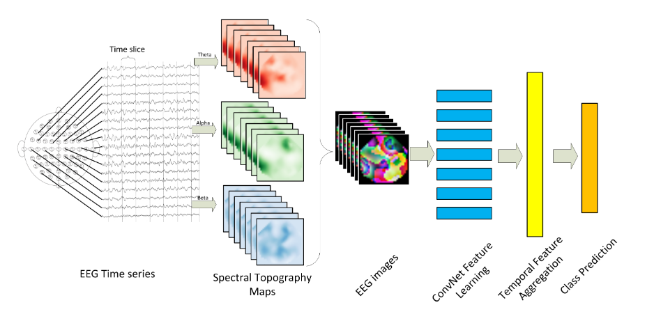
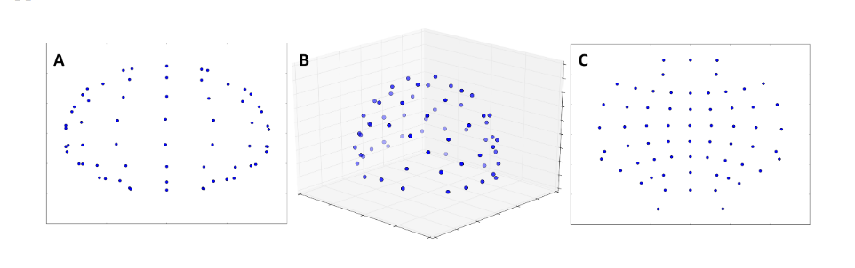
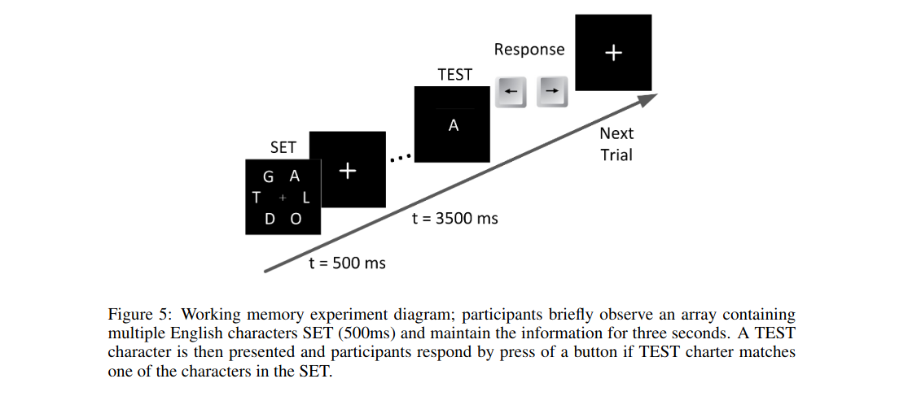
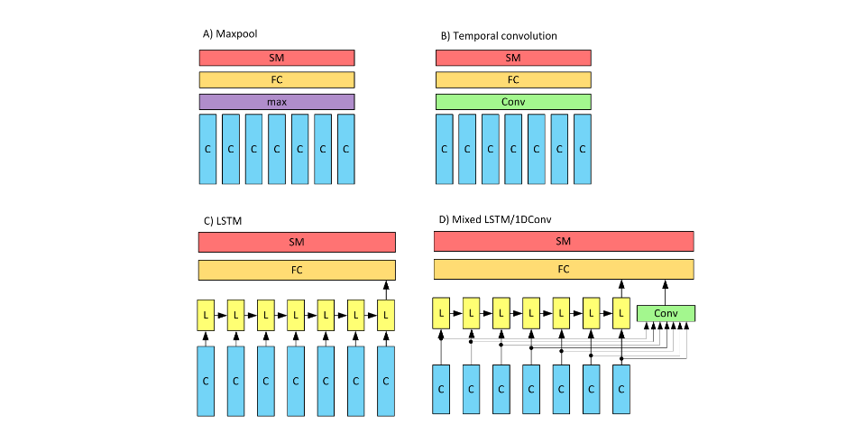
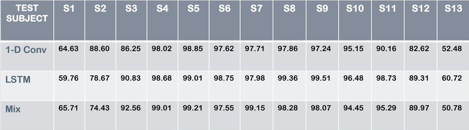

## Learning Representations from EEG with Deep Recurrent-Convolutional Neural Networks

One of the challenges in modeling cognitive events from electroencephalogram (EEG) data is finding representations that are invariant to inter- and intra-subject differences, as well as to inherent noise associated with such data. A novel approach for learning such representations from multi-channel EEG time-series, and demonstrate its advantages in the context of mental load classification task is proposed. 

First, we transform EEG activities into a sequence of topology-preserving multi-spectral images, as opposed to standard EEG analysis techniques that ignore such spatial information. Next, we train a deep recurrent-convolutional network inspired by state-of-the-art video classification to learn robust representations from the sequence of images. The proposed approach is designed to preserve the spatial, spectral, and temporal structure of EEG which leads to finding features that are less sensitive to variations and distortions within each dimension.

#
## Data Visualisation

(FIG.)Topology-preserving and non-topology-preserving projections of electrode locations.  A)2-D projection of electrode locations using non-topology-preserving simple orthographic projection.B) Location of electrodes in the original 3-D space.  C) 2-D projection of electrode locations usingtopology-preserving azimuthal equidistant projection.
#
---
## Keynote
These implementations have not been checked by original authors, only reimplemented from the paper description and open source code from original authors.

## Installations / Dependencies
In order to run this code you need to install the following modules:

1. [Numpy and Scipy](http://www.scipy.org/install.html)
2. [Scikit-Learn](http://scikit-learn.org/stable/install.html)
3. [Theano](http://deeplearning.net/software/theano/install.html)
4. [Lasagne](http://lasagne.readthedocs.org/en/latest/user/installation.html)

Also run : *pip3 install -r requirements.txt*

## Data 
Detailsof procedures for data recording and cleaning are reported in the author's previous publication [Bashivanet al., 2014](https://www.researchgate.net/publication/266621270_Spectrotemporal_dynamics_of_the_EEG_during_working_memory_encoding_and_maintenance_predicts_individual_behavioral_capacity)
We took data (which was basically a set of points out of which we had to generate images on our own) that the author provided in this paper. 
# 
## Working

## Learning Models
* First try Convolution Neural Net (CNN)
* New is a 3D convolutional NN (CNN3D) in the frequency domain
* Then try Long-Short Term Memory Recurrent Neural Net (LSTM)
* Finally do, Mix-LSTM / 1D-Conv

# 

## Instructions to run
In your command prompt

* git clone https://github.com/satyam9753/NNFL-EEG-DRCNN.git
* cd colab
* jupyter notebook

Then adjust the file path of the *'data' folder*

**Alternative**

* git clone https://github.com/satyam9753/NNFL-EEG-DRCNN.git
* python3 train.py
# 
## Results

## Reference
Bashivan, et al. "Learning Representations from EEG with Deep Recurrent-Convolutional Neural Networks." International conference on learning representations (2016).

http://arxiv.org/abs/1511.06448

## Group Members
* Satyam Anand
* Tanuj Khandelwal
* Debabrata Chaudhury
